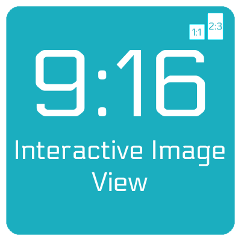

<p align="center">
    
</p>

<p align="center">
    
    <a href="https://cocoapods.org/pods/InteractiveImageView">
        
    </a>
    <a href="https://github.com/Carthage/Carthage">
        
    </a>
    <a href="https://swift.org/package-manager">
        
    </a>
</p>

Welcome to **Interactive Image View**, a simple library that provides an easier way to interact with image view, like scroll, zoom and crop. In its core it support two image content mode, the one is always square and the second one is custom. For example you can use aspect ration like instagram does 2:3 or 9:16, or any custom value. Basically, it's a thin wrapper around the `UIScrollView` and `UIImageView` APIs that `UIKit` provides.

## Features

- [X] Use at any place as UIView, no need to present or configure a viewcontroller.
- [X] Crop image at current position as user wants.
- [X] Switch between aspect ration, 2:3 or 1:1, same as Instagram.
- [X] Can be extended to support different aspect rations.
- [X] Scroll image view on x and y axis.
- [X] Double tap to zoom in or zoom out.
- [X] Rotate image by given degrees.
- [X] Pinch image view.

### Preview
<p align="left">
    
</p>

## Setup

1. Add a view, and set the class of the view to `InteractiveImageView`.
2. In your view controller, import InteractiveImageView.
3. Connect view outlet, configure it with `interactiveImageView.configure(...)`
4. Add delegates `interactiveImageView.delegate = self`
5. Listen to delegate observers: `extension ViewController: InteractiveImageViewDelegate { ... }`
        
## Methods
#### Configure view
```swift
if let image = UIImage(named: "image.png") {
    interactiveImageView.configure(withNextContentMode: .heightFill,
                      withFocusOffset: .center,
                      withImage: image)
}
```
#### Crop and get image without delegate methods
```swift
let croppedImage = interactiveImageView.cropAndGetImage()
```
#### Get original image without any modification on it.
```swift
let originalImage = interactiveImageView.getOriginalImage()
```
#### Set only image in the ImageView.
```swift
interactiveImageView.setImage(UIImage)
```
#### Toggle image content mode
```swift
interactiveImageView.toggleImageContentMode()
```
#### Rotate image
```swift
interactiveImageView.rotateImage(UIImage, keepChanges: Bool)
```

## User gestures
#### Double tap to zoom gesture
```swift
interactiveImageView.isDoubleTapToZoomAllowed = false
```
#### Scroll view
```swift
interactiveImageView.isScrollEnabled = false
```
#### Pinch to zoom gesture
```swift
interactiveImageView.isPinchAllowed = false
```
## Delegate methods
```swift
protocol InteractiveImageViewDelegate: AnyObject {
    func didCropImage(image: UIImage, fromView: InteractiveImageView)
    func didScrollAt(offset: CGPoint, scale: CGFloat, fromView: InteractiveImageView)
    func didZoomAt(offset: CGPoint, scale: CGFloat, fromView: InteractiveImageView)
    func didFail(_ fail: IIVFailType)
}
```

## Example Project
You can download and run example project `InteractiveImageViewExample`.

## Installation

### CocoaPods

[CocoaPods](https://cocoapods.org) is a dependency manager for Cocoa projects. For usage and installation instructions, visit their website. To integrate InteractiveImageView into your Xcode project using CocoaPods, specify it in your `Podfile`:

```ruby
pod 'InteractiveImageView'
```

### Carthage

[Carthage](https://github.com/Carthage/Carthage) is a decentralized dependency manager that builds your dependencies and provides you with binary frameworks. To integrate InteractiveImageView into your Xcode project using Carthage, specify it in your `Cartfile`:

```ogdl
github "egzonpllana/InteractiveImageView"
```

### Swift Package Manager through Manifest File

The [Swift Package Manager](https://swift.org/package-manager/) is a tool for automating the distribution of Swift code and is integrated into the `swift` compiler.

Once you have your Swift package set up, adding InteractiveImageView as a dependency is as easy as adding it to the `dependencies` value of your `Package.swift`.

```swift
dependencies: [
    .package(url: "https://github.com/egzonpllana/InteractiveImageView.git", .upToNextMajor(from: "1.0.0"))
]
```

### Swift Package Manager through XCode
To add InteractiveImageView as a dependency to your Xcode project, select File > Swift Packages > Add Package Dependency and enter the repository URL
```ogdl
https://github.com/egzonpllana/InteractiveImageView.git
```

## Backstory

So, why was this made? While I was working on a project to provide an interactive image view based on given aspect ration, I could not find a suitable solution that offers all in one these features working in a single view without a need for a viewcontroller, so I build it.

## Questions or feedback?

Feel free to [open an issue](https://github.com/egzonpllana/InteractiveImageView/issues/new), or find me [@egzonpllana on LinkedIn](https://www.linkedin.com/in/egzon-pllana/).
